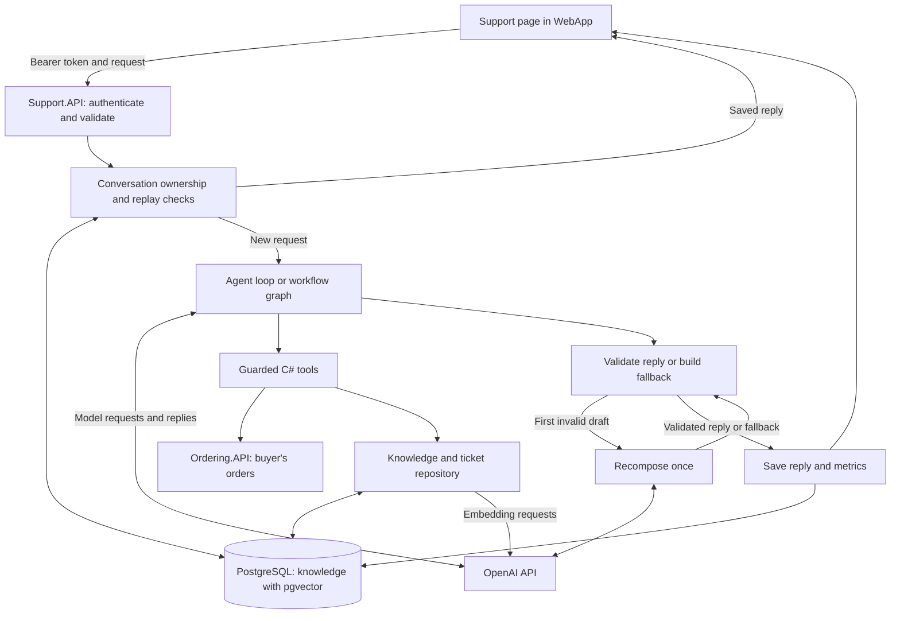

# AI support architecture

This document describes the current support implementation. Both modes share
authentication, conversation persistence, guarded tools and reply validation.
The diagram summarizes `POST /api/support/ask`; agent and workflow routing are
described in [ADR 0002](adr/0002-custom-agent-loop-and-framework-workflow.md).

## Request path

The PostgreSQL box represents the `knowledge` database. Policy vectors, tickets
and conversation tables have different responsibilities within that database.
Model requests pass through `OpenAiApi`; the model does not call business services
or write to PostgreSQL directly. The agent can also recompose a reply after C#
adds required facts, even when its first draft passes validation.

## Responsibilities

| Component | Responsibility |
| --- | --- |
| [Support page](../src/WebApp/Components/Pages/Support.razor) and [SupportService](../src/WebApp/Services/SupportService.cs) | Collect the question, selected order, current permission and request IDs; display replies, sources, trace and metrics. WebApp forwards the buyer's bearer token. |
| [Program](../src/Support.API/Program.cs) | Authenticate the token, validate request fields, set the execution timeout and map errors to HTTP responses. |
| [Conversation service](../src/Support.API/ConversationMemory.cs) and [repository](../src/Support.API/ConversationRepository.cs) | Check ownership, serialize messages in a conversation, load history, detect replay and persist completed replies. |
| [SupportAgent](../src/Support.API/SupportAgent.cs) and [SupportWorkflow](../src/Support.API/SupportWorkflow.cs) | Execute model-selected tool calls or the predefined graph using the same request context. |
| [SupportTools](../src/Support.API/SupportTools.cs) | Allow only registered actions; enforce current permission, selected-order ownership and ticket-write constraints. |
| [OrderingClient](../src/Support.API/OrderingClient.cs) and [KnowledgeRepository](../src/Support.API/KnowledgeRepository.cs) | Read buyer-filtered orders, retrieve policy chunks and persist demo tickets. |
| [OpenAiApi](../src/Support.API/OpenAiApi.cs), [ReplyComposer](../src/Support.API/ReplyComposer.cs) and [metrics collector](../src/Support.API/SupportMetricsCollector.cs) | Call the model and embedding endpoints, compose and validate replies, produce fallback text, and record timing and usage. |

## Trust boundary

Questions, conversation text, retrieved documents and model output can influence
search and wording. They cannot grant permissions. C# obtains identity from the
validated JWT and checks order ownership through the buyer-filtered Ordering.API
list. The current request supplies the selected order and `AllowTicket`; neither
is accepted from model-generated tool arguments. `CreateSupportTicket` rechecks
permission and ownership before writing. The API key and bearer token are not
added to model messages or tool schemas. See
[ADR 0001](adr/0001-model-proposes-code-decides.md).

## Replay and persistence

A completed request is identified by `(conversationId, requestId)` and a hash of
its payload. Matching identifiers and payload return the saved reply without
model or tool execution. A changed payload returns HTTP 409; an inaccessible
conversation returns HTTP 404. Matching question text alone is not a replay.

Ticket writes independently enforce `UNIQUE(user_id, order_id, request_id)`.
This protects a retried write if processing stopped before a reply was saved.
Conversation processing holds a row lock until its database transaction ends.
Saved replies are snapshots; graph checkpoints and arbitrary-node resumption are
not implemented.

## Current behavior and limits

- `AllowTicket=true` currently requests ticket creation for an owned order. The
  agent completes an omitted action in C#; the workflow selects a graph branch.
  Permission-only ticket decisions are planned, not implemented.
- RAG searches eight demo documents using cosine distance, up to three chunks
  and a minimum score of 0.30. Embeddings have 1536 dimensions. These defaults
  still need retrieval evaluation.
- Validation checks source IDs and confirmed ticket numbers. Invalid drafts get
  one repair attempt, then a deterministic fallback. Valid citations do not
  establish semantic correctness.
- Preparation timing includes history loading and processing, but stops before
  reply persistence. Missing usage remains unknown; replay reports its own metrics.
- The [23 offline checks](../tests/Support.SelfTests/Program.cs) use fake
  dependencies. Real-model quality and PostgreSQL integration need separate checks.
- Model integration remains provider-specific; see
  [ADR 0003](adr/0003-direct-responses-api.md).
